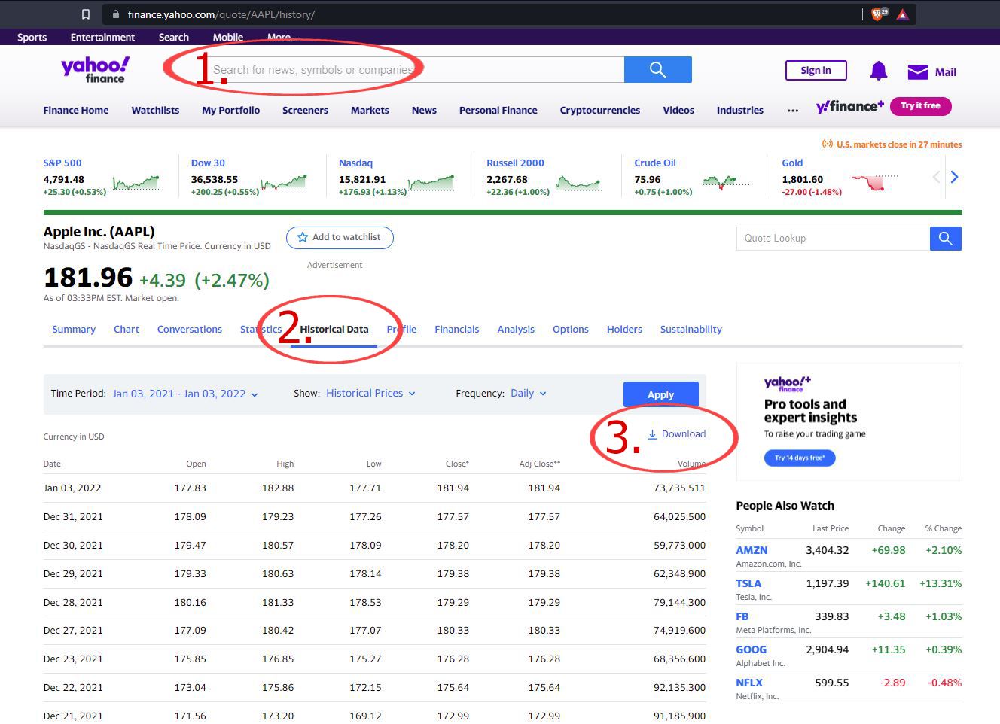
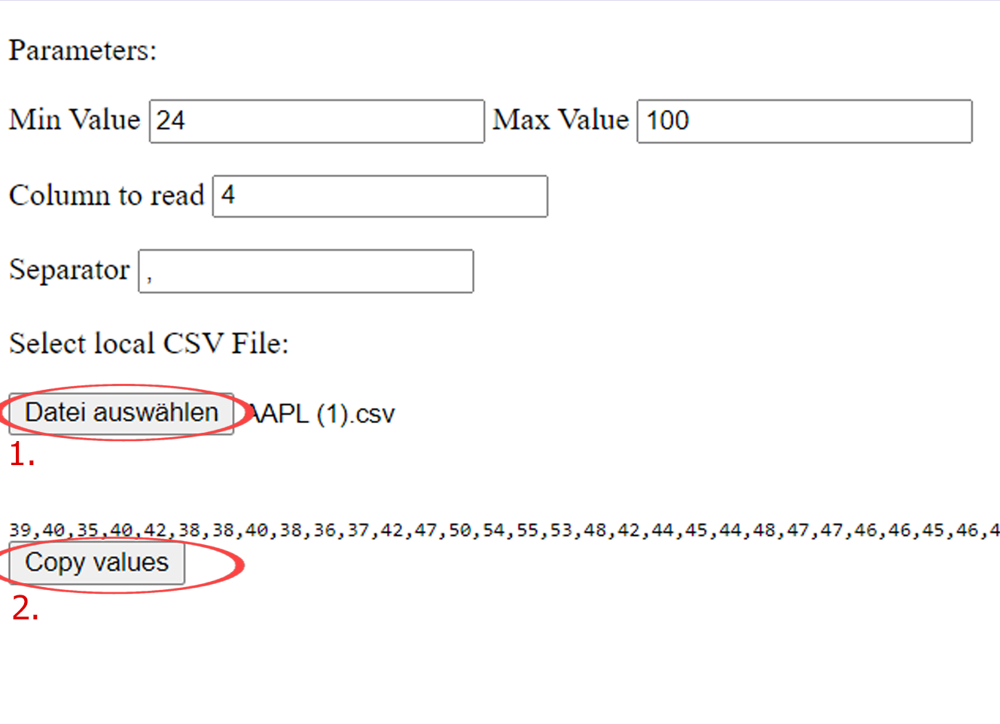
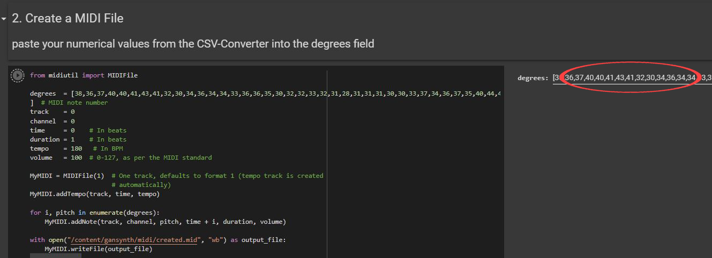

# Comppx_Stocks

This is a Project from Daniel Schwager

## 1. step

Download historical price data with the help of Yahoo finance.

1. Search in the search box for a stock or cryptocurrency you want to use to generate audio.
2. Switch to the Hystorical Data tab.
3. Download the csv file.

## 2. step

Extract a list of mapped values from the CSV file.
[CSV Converter](csv_converter/index.html)

1. Select the CSV file you have downloaded before.
2. Copy the numerical values. We will need these later.
3. (additionally)
   play around with the values. Min and Max Value specifies the range to which the numbers are mapped. Column to read specifies which column will be read. The separator is for when the CSV file uses a different character to separate the columns, when the data comes from a different source or was first edited in Excel.

## Google Collab

[Google Collab Notebook](https://colab.research.google.com/drive/1vz6apDn68PF9NG3faSi9S6VAQKqy6FsE#scrollTo=eQVvInM6a0lw)

1. Run the installation cell.
2. Before running the 2nd cell, paste the values extracted in step 2 into the "degrees:" field.
   
3. In cell 3, the midi file created in step 2 is selected by default. However, you can still upload your own midis here.
4. In the last step, you can use the slider to specify after how many seconds the instruments will randomly interpolate.
